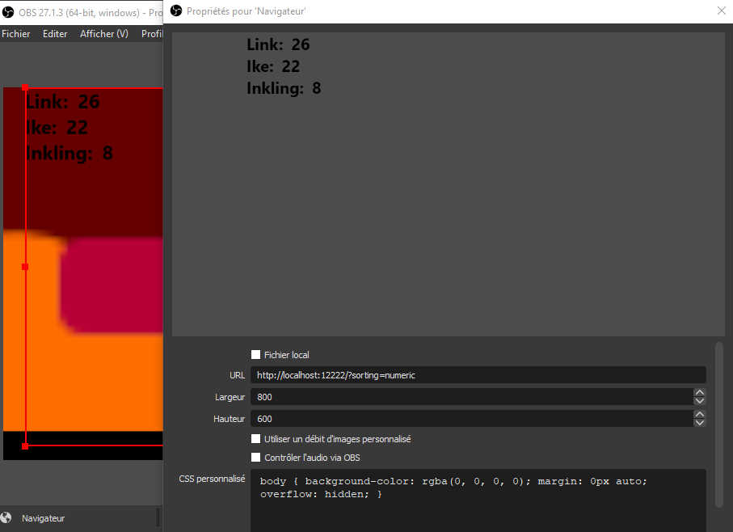
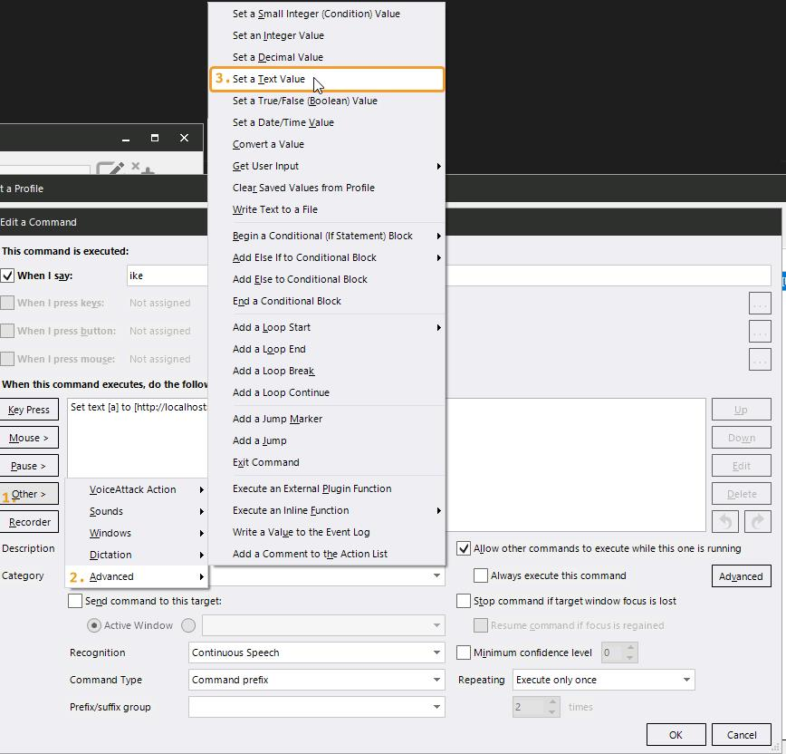
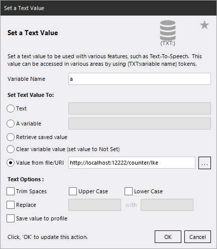

# OBS counters overlay

This is a simple webpage to integrate on OBS as a Browser source to display counters that can be increased/decreased with web request.
That way, you can control the counters with a simple Python script or with VoiceAttack or with anything else that can make an HTTP GET request.

The counters are stored in the file `counters.json`, it stores the date of each incrementation if you need to use it later. Be warned: when decrementing, it removes the date of last incrementations.

See it in action [here](https://youtu.be/D9sn_9BwODc)!

## Dependencies

- Tested with [Node.js](https://nodejs.org/en/download/) 14.x/16.x

## How to run

First, get the dependencies by running, at the project root directory, in a terminal:
```sh
npm install
```

Then, to run, in a terminal, at the project root directory, run:
```sh
npm start
```

You can administrate the currently recognized counters at `http://localhost:12222/admin/`. For a counter to appear, it must be called at least one time through the API (via VoiceAttack for example).

## OBS integration

Just add a browser source to the URL `http://localhost:12222/`.
There is URL parameters available to customize the render of the counters.

URL parameters:
- `sorting`           - `alphabetic`/`numeric`, set the order of the entries (default to alphabetic)
- `reverse-sorting`   - `true`/`false`, reverse the order set with the parameter `sorting` (default to `false`)

For example, if you want the counters to be sorted by their value from least to most, use this URL as a source on OBS: `http://localhost:12222/?sorting=numeric&reverse-sorting=true`



## API

All the API calls are made with HTTP GET requests on these URLs:
- `http://localhost:12222/counter/:counter-name-url-escaped` Will increment the `:counter-name-url-escaped` by 1. (example: `http://localhost:12222/counter/My%20super%20counter` will increment the counter `My super counter` by 1)
- `http://localhost:12222/counter/:counter-name-url-escaped/:count` Will increment/decrement the `:counter-name-url-escaped:` by `:count`. (example: `http://localhost:12222/counter/My%20super%20counter/5` will increment the counter `My super counter` by 5)
- `http://localhost:12222/counters/reset-counter/:counter-name-url-escaped` Will reset the `:counter-name-url-escaped:` to 0.
- `http://localhost:12222/counters/reset` Will reset every counters to 0.

To completely remove a counter, shutdown the server, remove the counter from the `counters.json` file and restart the server.

## Increment with VoiceAttack

- Add a command from the menu Other > Advanced > Set a Text Value
- Check `Value from file/URI` and enter a URL following the API.




